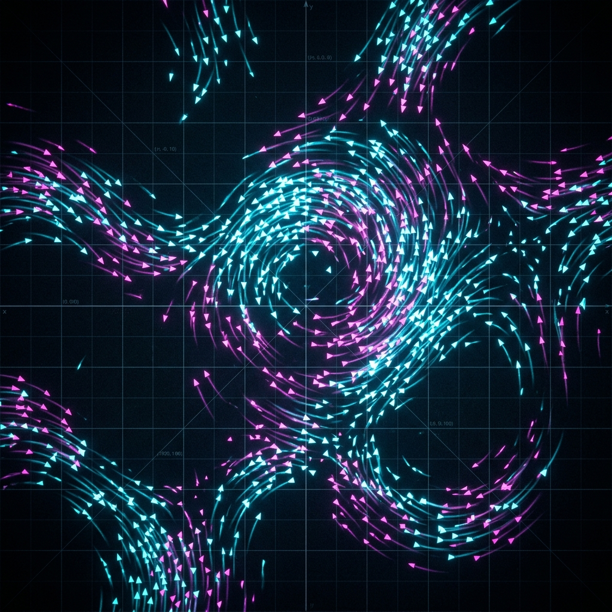
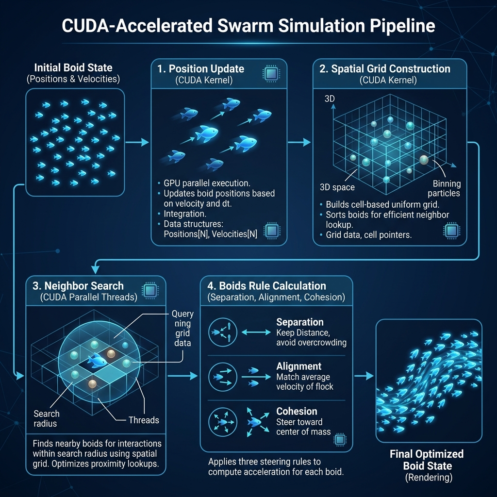
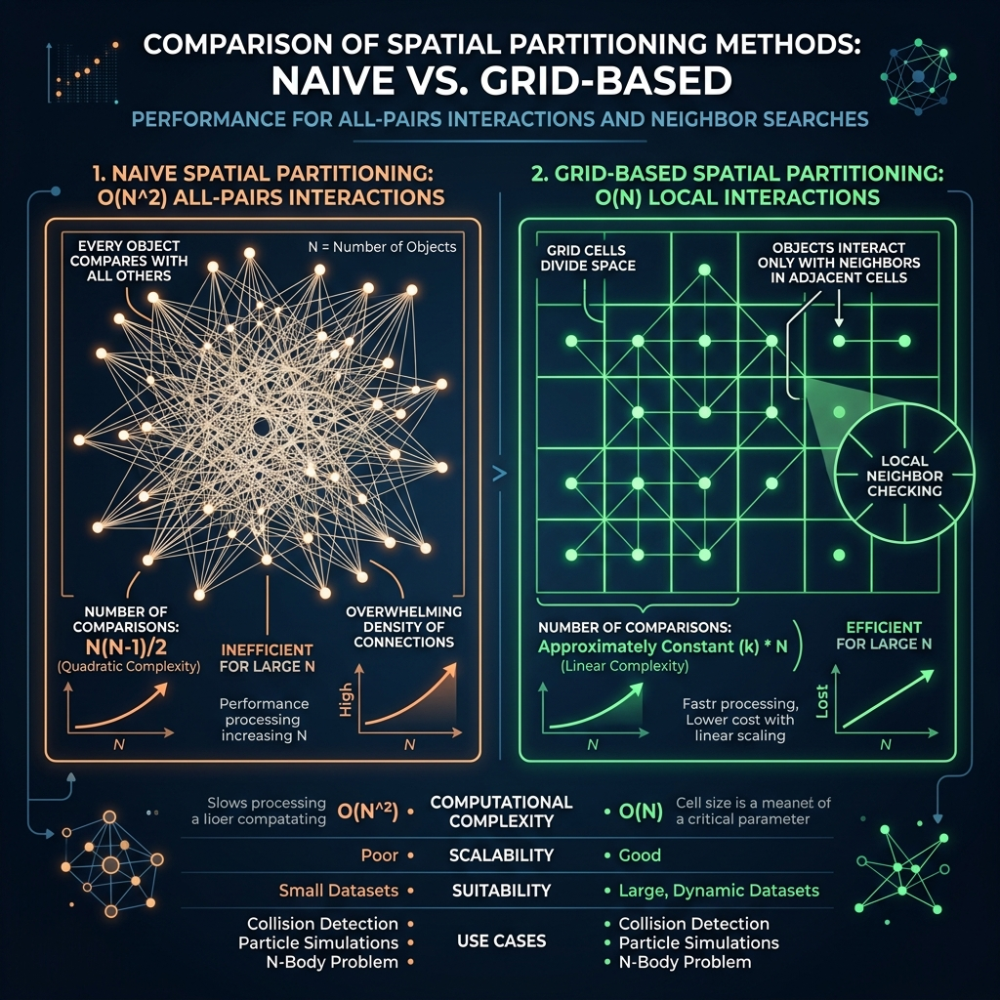

# Interactive CUDA-Accelerated Swarm Simulation with Uniform-Grid Spatial Partitioning and Real-Time OpenGL Visualization



A high-performance C++ swarm simulation leveraging CUDA-accelerated spatial partitioning to handle thousands of agents in real-time. This project implements the Boids algorithm with multiple simulation backends to demonstrate the performance benefits of spatial data structures and GPU acceleration.

## 🚀 Key Features

- **Multiple Backends**: Compare performance between CPU and GPU, and between Naive $O(N^2)$ and Grid-based spatial partitioning.
- **CUDA Acceleration**: Custom CUDA kernels for parallelizing both the simulation update and the grid construction.
- **ZLUDA Compatibility**: Designed to run on non-NVIDIA hardware like AMD via ZLUDA, ensuring broad accessibility.
- **Real-time Visualization**: OpenGL-based rendering with custom shaders for smooth agent movement.
- **Benchmarking**: Integrated CSV logger and frame statistics for performance analysis.

## 🏗️ Architecture & Pipeline

The project uses a sophisticated GPU pipeline to organize agents into a spatial grid, significantly reducing the number of distance checks per frame.



1.  **Cell Index Computation**: Map each agent's $(x, y)$ position to a grid cell ID.
2.  **Grid Reset**: Clear previous frame's occupancy data.
3.  **Agent Counting**: Atomic operations to count agents per cell.
4.  **Prefix Sum (Scan)**: Calculate memory offsets for each cell's agent list.
5.  **Agent Reordering**: Organize agent indices into contiguous memory blocks based on cell ID.
6.  **Boids Simulation Kernel**: Execute physics updates with $O(1)$ neighbor lookup.

## 🛠️ Build Instructions

### Prerequisites
- CMake (3.20+)
- Ninja Build System
- CUDA Toolkit (12.0+)
- MSVC (Visual Studio 2022)

### Building
Standard CMake build process:

```powershell
mkdir build
cd build
cmake -G "Ninja" ..
ninja
```

This will create a `build` directory, configure the project using Ninja, and compile the application. Ensure your environment is configured for MSVC and CUDA before running these commands.

## 🎮 Controls

Once the simulation is running, use the following keys to interact with it:

| Key | Action |
| :--- | :--- |
| `1` | Switch to **CPU Naive** Backend |
| `2` | Switch to **CPU Grid** Backend |
| `3` | Switch to **CUDA Naive** Backend |
| `4` | Switch to **CUDA Grid** Backend |
| `SPACE` | Spawn 500 agents |
| `R` | Reset simulation |
| `P` | Pause / Resume |
| `L` | Toggle CSV Performance Logging |
| `ESC` | Exit Application |

## 📊 Performance Comparison

Spatial partitioning reduces the neighbor search complexity from **$O(N^2)$** to effectively **$O(N)$** (assuming uniform distribution). This allows for simulating tens of thousands of boids at 60+ FPS on modern hardware.



---
*Created as part of CMP674.*
